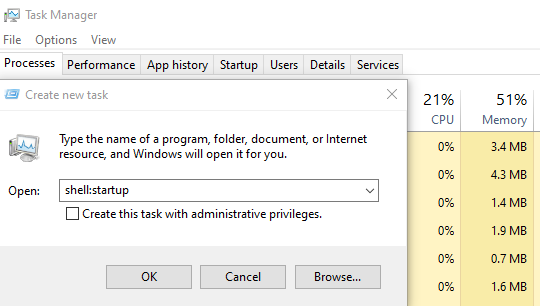

Got the answer from ChatGPT:

To add software to auto-start in Windows 10 when booting, you can place the application's shortcut in the Startup folder. Press `Win + R`, type `shell:startup`, and press `Enter` to open the Startup folder. Then, create or copy a shortcut of the software you want to auto-start into this folder. Upon the next reboot, Windows will automatically launch the applications present in the Startup folder.

If `Win + R` is not available, you can do the following.

1. Open Task Manager.
2. Click on "File" in the top menu.
3. Select "Run new task" from the dropdown menu.
4. Type `shell:startup` and press Enter or click "OK."

