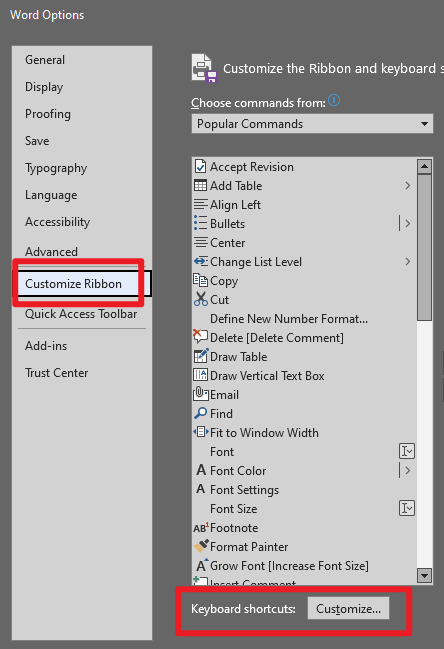
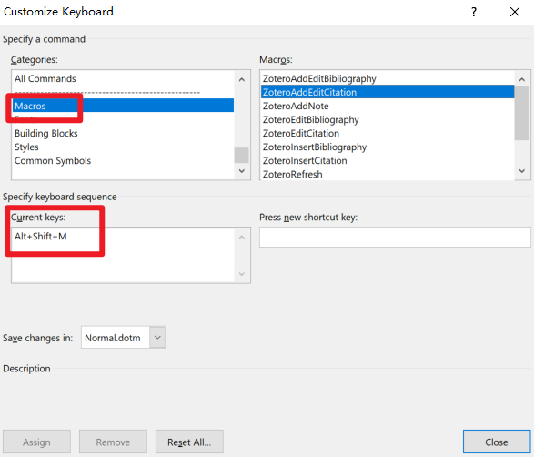

I always forget how to add the "Add/Edit Citation" shortcut for Zotero in Word. 

Here I record what I did.

1. Go to Word, File --> Options --> Customize Ribbon --> Keyboard shorcuts: Customize (at the bottom)

2. Click "Categories", all the way down to "Macros".
3. Click "ZoteroAddEditCitation", type new shortcut. I use **ALT+SHIFT+M**.

See screenshots below:

