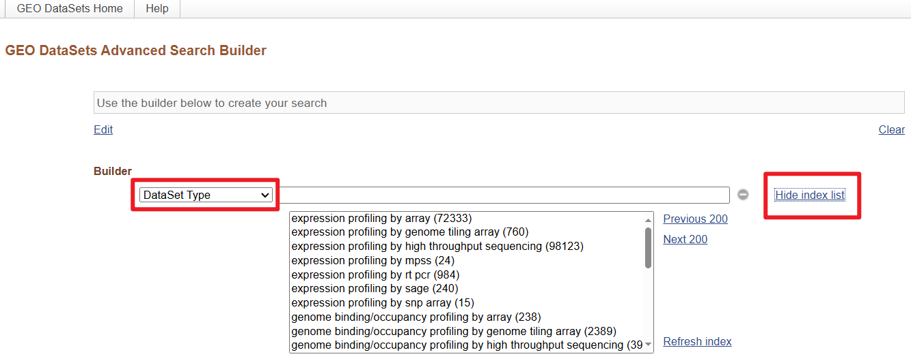
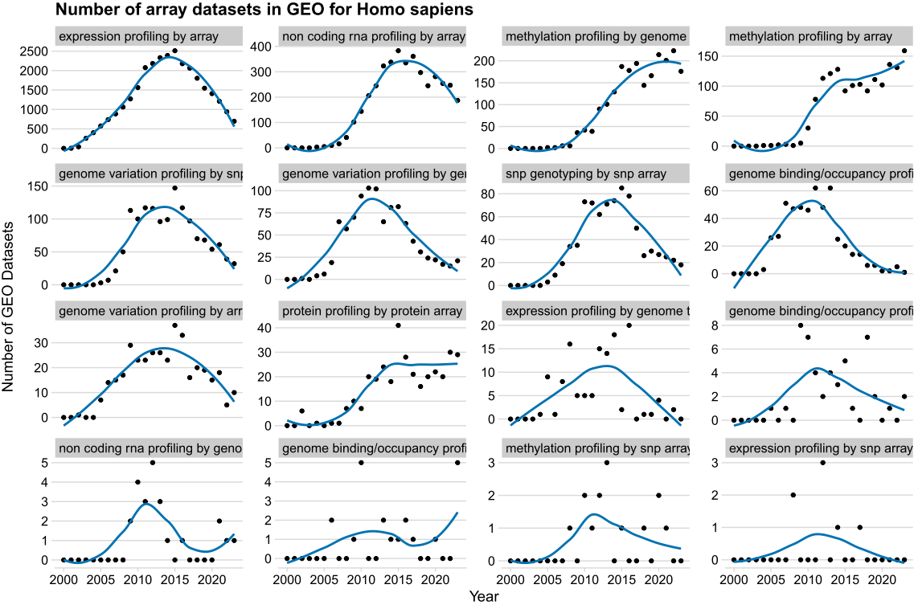
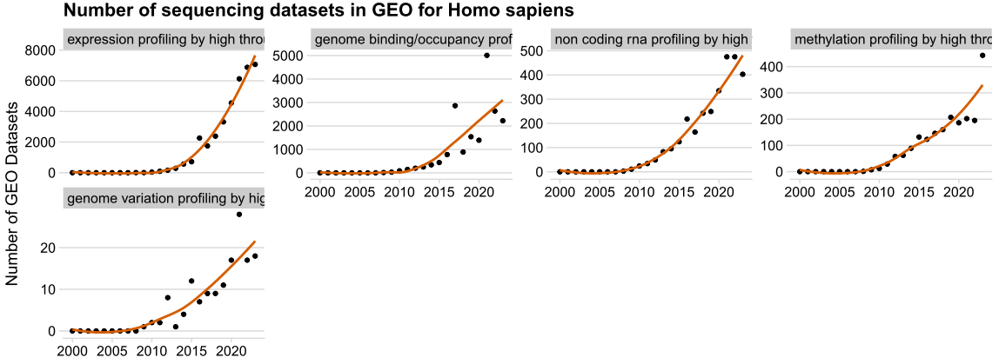
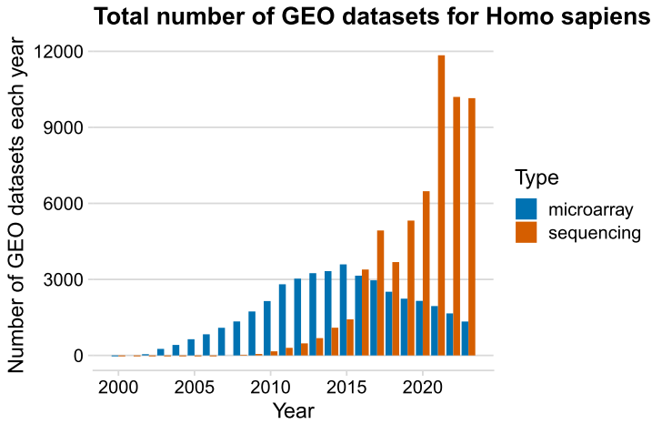

I wrote a R script to query the NCBI-GEO datasets to see whether microarrays are still been used for several species. I also query the sequencing datasets.

This is not a perfect search as I only queried the GEO. Many sequencing libraries are only at SRA. Also, some early day microarray data is probably not on GEO. Besides, I only counted the number of *datasets*, not the samples within the datasets.

With that being said, I'm likely underestimate the sequencing data. 

A while back, I also wrote some Python code to query the number of DNA and RNA sequencing libraries on SRA. See `SRA_search.ipynb`. I wrote a R version before, but I can't find the script.

[Link to Github](https://github.com/timedreamer/NCBI_GEO_search/)

I got all the possible query terms for `Dataset Type` from [NCBI-GEO-Advanced Search](https://www.ncbi.nlm.nih.gov/gds/advanced).

Here are the results for the **Human**. The sequencing is totally taken up the GEO, only a small portion of array assays.

