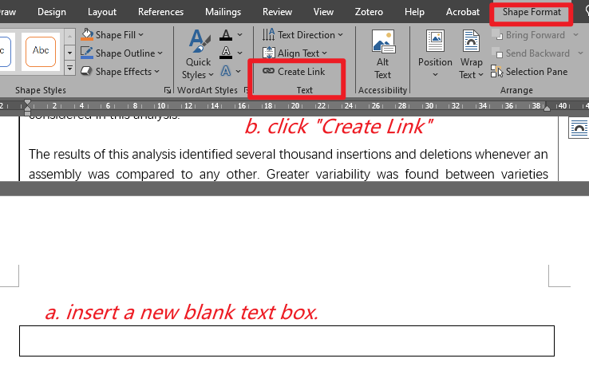

Sometimes, the text box in Word is expanding to two pages. Here is a way to continue the content in the text box to another page. I found the solution at [this website](https://www.pcreview.co.uk/threads/how-to-make-a-text-box-continue-onto-a-second-page.2174238/), described as below. 

> Insert another text box where you want the continuation. Click in the first
text box (where the continuation is coming from), and click the Create Text
Box Link button on the Text Box toolbar. The cursor changes to a tilted
paint can. Now click inside the continuation box, and the overflow from the
first box will "pour" into the second box.

1. Insert another text box and delete the content.
2. Double-click the first overflow text box.
3. In **Shape Format**, **Text**, click **Create Link**.
4. Now click the blank text box. 
5. The content is continuous now, and you can adjust both boxes.

Here is the screenshot:

