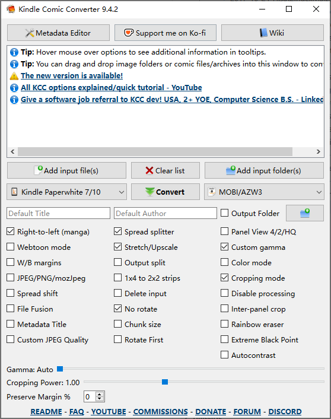

> **简介**：基于 KCC 与 KindleGen 的去白边及满屏显示配置方案，专为 Kindle Paperwhite 10 代及类似设备优化。

## 🛠️ 所需工具

* **Kindle Comic Converter (KCC)**: [GitHub Releases](https://github.com/ciromattia/kcc/releases) —— 用于漫画切边、对比度优化及格式转换。
* **KindleGen**: [KCC Wiki Installation](https://github.com/ciromattia/kcc/wiki/Installation#kindlegen) —— 核心转换组件。

我安装在：`D:\Software\KCC`

> **安装必读**：下载 KindleGen 后，必须手动将 `kindlegen.exe` 复制并粘贴到 KCC 的安装根目录下（即与 `KCC.exe` 所在的同一个文件夹内），否则无法生成 `.mobi` 或 `.azw3` 格式。

---

## 📝 操作步骤

### 1. 确认设备型号

在 KCC 中选对型号至关重要，因为这决定了输出分辨率和长宽比。

* **查看方法**：在 Kindle 上点击 `设置` > `设备选项` > `设备信息` 查看。
* **示例**：Kindle Paperwhite 第 10 代（序列号前缀通常为 G000PP 等）。

### 2. KCC 参数设置 (针对 Kindle 屏幕优化)

| 选项 | 设置 | 说明 |
| --- | --- | --- |
| **设备型号** | `Kindle Paperwhite 7/10` | 匹配屏幕分辨率。 |
| **输出格式** | `MOBI/AZW3` | 适合 USB 传输；若使用无线传输建议选 `EPUB`。 |
| **Right-to-left** | **勾选** | 符合日式漫画从右向左的翻页逻辑。 |
| **Cropping mode** | **勾选** | **核心设置**：自动识别并切除多余白边。 |
| **Stretch/Upscale** | **勾选** | 将画面拉伸至满屏，消除黑边。 |
| **Spread splitter** | **勾选** | 跨页大图自动切分为两页，保证画面清晰。 |
| **Custom gamma** | **勾选** | 提升漫画对比度，线条更锐利。 |

截图如下：

### 3. 转换与传输

1. 点击 **`Add input file(s)`** 导入 PDF。
2. 点击 **`Convert`** 执行转换。
3. 通过 USB 连接 Kindle，将生成的 `.mobi` 或 `.azw3` 文件放入 Kindle 根目录的 **`documents`** 文件夹中。

---

## 💡 提示

* **护眼建议**：相比平板电脑，在 Kindle 上看漫画能显著减少蓝光刺激，且阅读体验更专注。
* **满屏效果**：通过 `Cropping Power`（默认 1.00）可以调节切边强度，如果白边仍多，可微调至 1.10。
