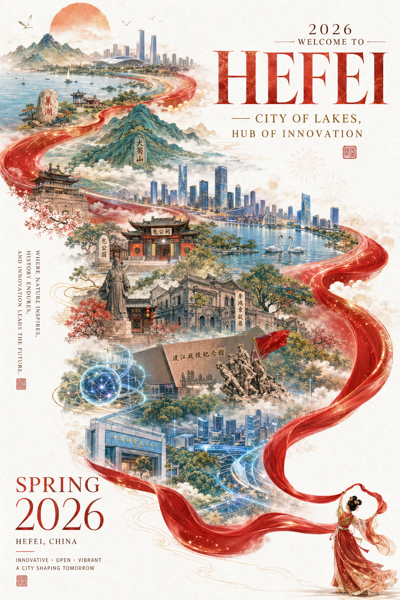

TL;DR: ChatGPT Image 2 is amazing!

---

I barely use any image generation services. I've used Nano banana 2 for some portraits and random idea plotting, but nothing stood out.

The GPT Image 2 model came out last week and the [results are impressive](https://openai.com/index/introducing-chatgpt-images-2-0/). In the meantime, I need to make a poster for my son's school project. I was thinking why not give it a try.

I want to make a poster about my hometown, Hefei. I saw a [prompt](https://x.com/liyue_ai/status/2045332620352119274?s=20) about Guangzhou, so I decided to give it a try to convert it to Hefei. 


I used ChatGPT to convert the prompt to Hefei and told it the prompt would be used for GPT Image 2 to generate a poster. The final prompt is below:

```text
一张面向国际受众、充满新春喜庆氛围但不失高雅格调的 **2026 合肥城市宣传海报**。整体风格精致、高级、富有东方美学气韵，具有明显的节庆感与城市形象传播感。采用 **双重曝光** 与 **国潮插画融合写实** 的表现手法，构图延续优雅流畅的 **S 型视觉动线**，画面兼具宏大叙事感、艺术感与海报设计感。

画面背景为 **纯白色带细腻纹理的高质感留白背景**，整体清新、干净、通透。画面右下角，一位 **身穿中国传统服饰的微缩人物** 正在挥舞一条 **长长的红色丝绸舞带**，舞姿轻盈优雅，富有节庆仪式感。红色丝绸飘逸流动，质感柔顺细腻，具有真实丝绸的光泽和层次，并沿着 S 型轨迹向左上方延展。在延展过程中，这条红绸奇幻地演变、融合、塑造成一幅壮丽的 **山水河湖城市长卷**，形成红绸与自然地貌、城市景观相互交融的视觉奇观。

在这条由红绸幻化而成的"山水长卷"中，叠加呈现一个 **合肥城市手绘全景图**，要求内容丰富、层次清晰、细节精致，兼具自然风光、历史文化与现代科技气质。重点表现 **合肥城市特色元素**：**巢湖** 的浩渺湖水与湖岸景观、**天鹅湖** 的现代都市天际线、**大蜀山** 的自然山体轮廓、**逍遥津公园** 的园林意境、**包公园** 与 **包公祠** 的传统古建风貌、**李鸿章故居** 的历史建筑特色、**渡江战役纪念馆** 的纪念性建筑气质，以及体现合肥"科技创新城市"形象的 **中国科学技术大学相关学术氛围元素、量子科技意象、科技光线、未来感城市建筑群、创新城区天际线**。整体画面要体现出"湖城共生、古今交融、科技引领未来"的城市气质。

画面中加入 **云雾缭绕、仙气朦胧、层层叠叠的轻烟与光晕效果**，增强意境和空间纵深感。色彩以 **中国红、金色、青绿色、湖蓝色、暖白色** 为主，兼具新春节日氛围与现代高级审美。整体要求 **色彩丰富但不杂乱，结构复杂但秩序分明，细节丰富且精致耐看**。由于大面积留白,整张海报依然要保持 **清新脱俗、雅致高级、国际化审美**。

版式设计要求具有专业海报感。左下角排版清晰呈现英文大字：**"SPRING 2026"**，并搭配一组 **竖排英文宣传语**。海报中的 **主标题、年份、核心宣传语等主要视觉文字必须使用英文**，适合美国受众阅读与传播。核心英文宣传语使用：
**"HEFEI — CITY OF LAKES, HUB OF INNOVATION"**
可将 **"HEFEI"** 作为主标题进行突出设计，字体优雅大方，清晰完整，具有国际城市宣传海报的高级感。
同时，**景点本身若自然出现匾额、题字、建筑名称或局部文化文字，例如"包公祠""李鸿章故居"等，可以保留中文**，以增强真实感和地域文化辨识度，但不要让中文喧宾夺主。

整体画面要求：**文字清晰可读、排版优美、层次明确、视觉中心突出、构图平衡、质感高级、细节完整**。突出"新春""东方美学""城市名片""国际传播"的气质。画幅比例 **2:3 竖版**。
```

Then I asked ChatGPT to generate the image using this prompt. The result blew me away! It wasn't perfect. The Chinese characters are still not 100% correct, but the overall aesthetics are on point.




I used the same prompt on Gemini using Nano banana 2, and the result is much worse. You can see it yourself.


This is the first time I saw a huge difference in image generation models. There are some more GitHub repos for prompt ideas: [awesome-gpt-image-2-prompts](https://github.com/EvoLinkAI/awesome-gpt-image-2-prompts), [awesome-gpt-image-2](https://github.com/YouMind-OpenLab/awesome-gpt-image-2), and [awesome-gpt-image](https://github.com/ZeroLu/awesome-gpt-image).
